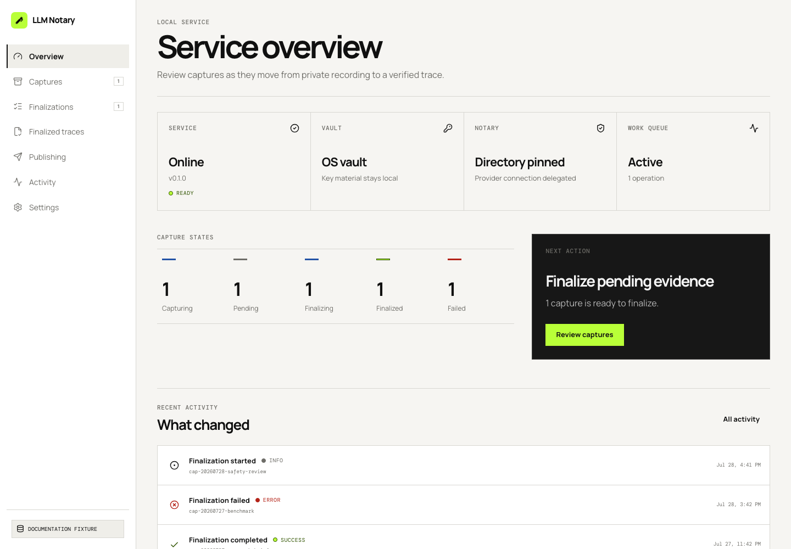
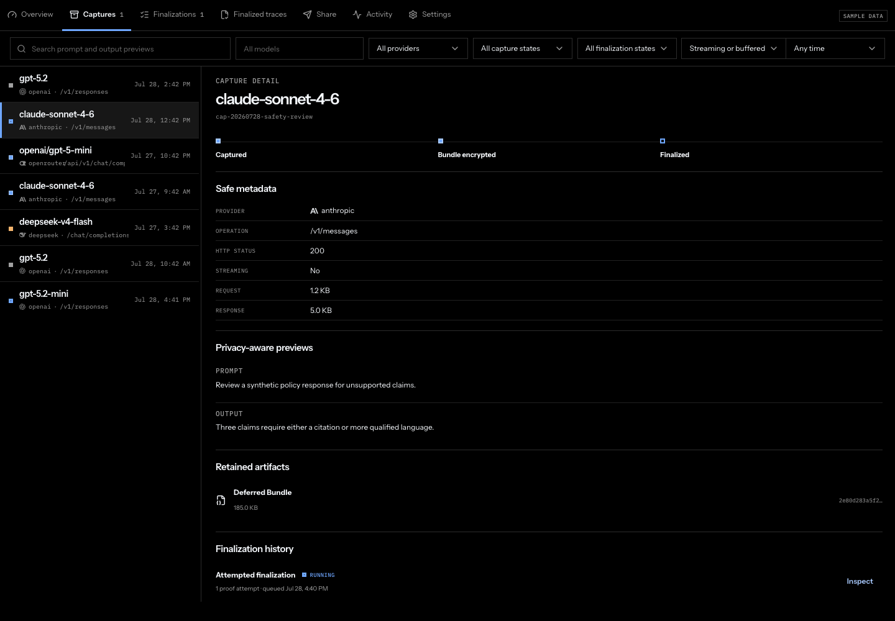
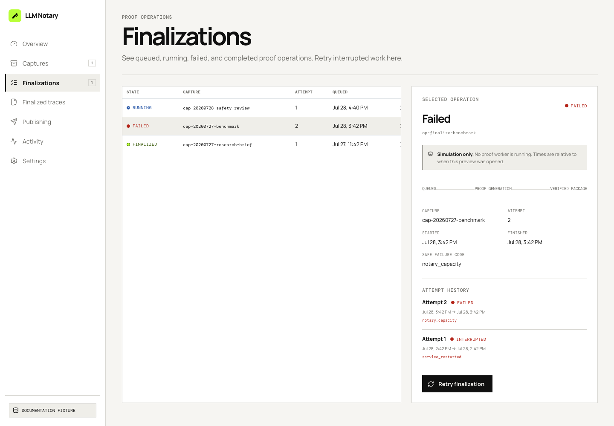
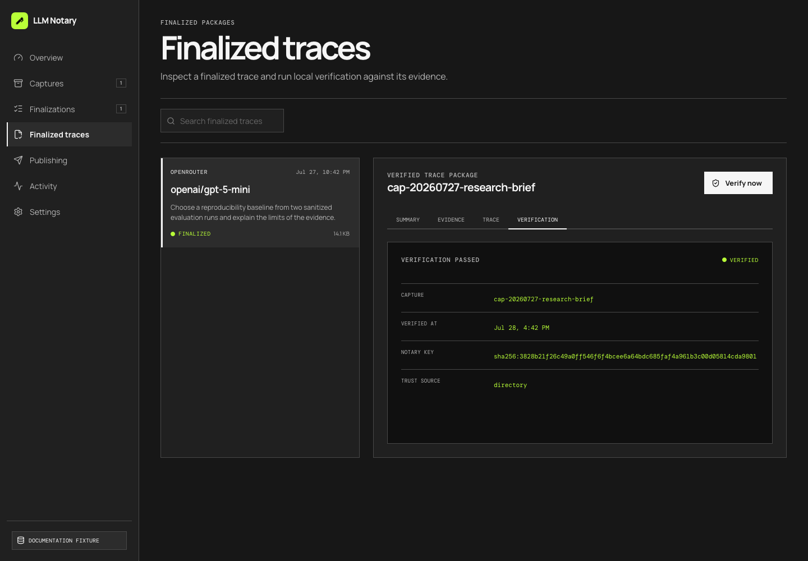
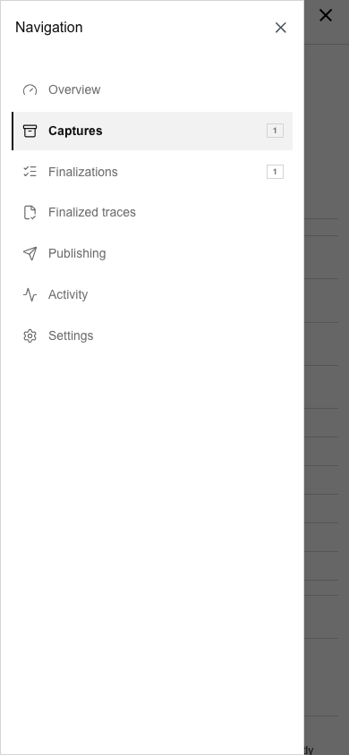
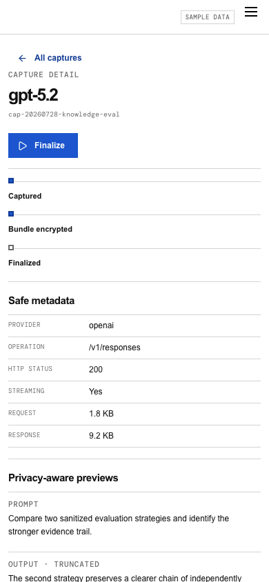

# Local evidence dashboard

Open [http://127.0.0.1:8788](http://127.0.0.1:8788) while `llm-notary` is
running. The default configuration opens the dashboard directly. If
`admin.auth` is configured, the service asks for that username and password,
exchanges them for an HttpOnly local session, clears the fields, and does not
store the password in a URL or browser storage.

The dashboard is served only by the loopback administration listener. The
provider proxy on port 8787 never serves it.

## Find the next useful action

**Overview** shows service, vault, notary, and work-queue health. The
capture-state strip distinguishes live captures, pending evidence, active
finalization work, finalized traces, and failures. Recent activity uses safe
event summaries and links back to the relevant work.



Use the sidebar to move between these parts of the local workflow:

- **Captures** searches and filters private evidence, then opens a selected
  capture in a detail panel.
- **Finalizations** shows durable queued, running, interrupted, failed, and
  completed proof operations.
- **Finalized traces** presents the portable package and an independent local
  verification action.
- **Publishing** keeps optional public publication separate from local proof
  creation and requires confirmation.
- **Activity** shows a bounded redacted event stream.
- **Settings** reports safe listener, vault, notary, and preview-policy
  state, contains the color-scheme control, and links to the live OpenAPI
  contract.

## Inspect a capture

Use full-text search over enabled previews, then narrow by model, provider,
capture state, finalization state, streaming mode, or time. A result always has
a textual state; color is only a second signal. The detail panel shows safe
model and response metadata, a lifecycle, privacy-aware truncated previews,
artifact availability, hashes, and prior finalization state. It never decrypts
or renders the source bundle. The finalization history links every durable
operation for that capture to its detailed attempt history.



A pending capture has one **Finalize** action. The service responds with a
durable operation, and the dashboard moves to its finalization view. Repeating
the action resolves to the already-active operation and is labeled as
deduplicated; it does not create parallel work.

## Monitor and retry finalization

The operation queue shows state, capture identifier, attempt, and enqueue time.
The inspector shows the known stage, timestamps, and `attempt_history`, with
one durable record for each worker attempt. Proof generation may take minutes.
The dashboard does not show a percentage because the service does not report
one.

Failed and restart-interrupted operations show only a safe failure code and a
**Retry finalization** action. Retry requeues the same durable operation.



## Verify a finalized trace

Select **Finalized traces**, choose a capture, and inspect four document-like
views:

- **Summary** describes the authenticated inference and package format, then
  renders the disclosed prompt and response as a readable conversation. This
  is finalized trace content, not decrypted source-bundle data.
- **Evidence** shows the exact trace hash, authenticated provider, source time,
  and manifest format reported by the selected package.
- **Trace** shows the canonical OpenTelemetry document.
- **Verification** contains the durable human-readable result after **Verify
  now** rechecks the package.



Bundle availability is not the same as trace verification. Only the
verification receipt confirms that the finalized package's evidence,
disclosure, hashes, provider mapping, and canonical trace bytes agree.

## Publish only with consent

The Publishing view first shows whether the service has an authorized public
account. Its device flow displays a short code and approval URL. After approval,
select one eligible finalized trace and review the explicit confirmation. The
source `.llmbundle` is never a publication input. Nothing is uploaded merely
because a trace was finalized or verified. After submission, the dashboard
retains the capture and job identifiers, then polls
`GET /v1/publications/{job_id}` through the local service for later admission
changes. Remote publication credentials never enter the browser.

## Activity and settings

Activity asks the service to filter by severity, capture identifier, operation
identifier, event type, or time instead of downloading a broad history and
filtering it in the browser. Events contain bounded messages and identifiers,
never request bodies, response bodies, raw headers, credentials, or filesystem
paths. Settings shows safe runtime facts, the System/Light/Dark control, and
the exact `http://127.0.0.1:8788/openapi.json` discovery URL for scripts and
coding agents.

## Responsive navigation and color mode

At 820 px and below, a fixed menu button opens the sidebar as a full-height
drawer, and capture and trace list/detail workspaces become separate routed
panels. The local app has no separate header; its brand and navigation live in
the desktop sidebar. Use the back action to return from an inspector. Keyboard
focus is visible, dialogs and drawers return focus to their trigger, and
reduced-motion preferences are respected.



After the drawer closes, the selected capture occupies a single mobile panel
with a clear back action; the desktop list is not squeezed beside it.



Settings provides **System**, **Light**, and **Dark** choices. System follows
the operating-system preference and is the default. An explicit override is
stored locally and can always be returned to System. Dark mode uses neutral
charcoal surfaces; the lime accent remains reserved for verified or ready
states and a focal action.

## Troubleshooting

| Symptom | What to check |
| --- | --- |
| Service unavailable | Confirm the foreground process is running and the browser uses the configured loopback admin address, normally port 8788. |
| Address already in use | Stop the other process or assign distinct loopback `proxy.listen` and `admin.listen` ports, then restart. |
| Unauthorized session | Confirm that `admin.auth` is enabled, then enter its configured username and password. Restart the service after changing the hash. Never add the password to the URL. |
| Vault unavailable | Unlock the OS credential store or supply the configured private passphrase file, then restart. Do not move encrypted bundles outside their initialized vault profile. |
| Notary directory unavailable | Check network access and directory configuration. An explicit local notary endpoint is appropriate only for local/self-hosted development. |
| Operation interrupted | A running job was stopped by service restart. Inspect its safe code and use Retry finalization. |
| Missing artifact | Keep the catalog, encrypted bundle directory, and finalized package directory together. The API intentionally does not accept a replacement filesystem path. |
| Safe failure code | Use the code for diagnosis, then inspect local process logs. Logs omit credentials, headers, and evidence plaintext but may contain configured paths, so do not share them verbatim. |

## Documentation fixture and screenshots

All images above come from `js/app/src/local-dashboard/fixtures.ts`. The data
is synthetic and fixed: it contains no real user prompts, provider keys, account
names, local paths, or bundle contents. Desktop viewports use 1440 × 1000 px;
the mobile viewport uses 390 × 844 px. The browser locale is `en-US` and its
timezone is UTC so timestamps remain deterministic. The overview,
finalization, and mobile images use Light mode. Captures and trace verification
use Dark mode.

Interactive fixture actions are simulated entirely in the browser. Device
authorization never opens GitHub, publication advances from queued to admitted
without an upload, and the admitted-fixture action returns to the synthetic
local trace. The fixture Vite server also serves the generated contract at
`/openapi.json`, matching the real admin listener. No fixture action contacts a
provider, notary, publication platform, or account service.

When opened normally, fixture timestamps are generated relative to the current
time. A visible note identifies operation states as simulations rather than
real background workers. Screenshot generation supplies an explicit fixed
fixture clock so the committed images remain reproducible.

Regenerate every image from the repository root after a dashboard change:

```bash
npm --prefix js/app ci
npx --prefix js/app playwright install chromium
npm --prefix js/app run capture:dashboard-docs
npm --prefix js/app run check:local-docs
```

The capture command starts an isolated Vite server on `127.0.0.1:4175`, opens
fixed fixture deep links in headless Chromium, and replaces only the six files
under `docs/images/local-dashboard/`. Review every image for layout and
sensitive data before committing it.
