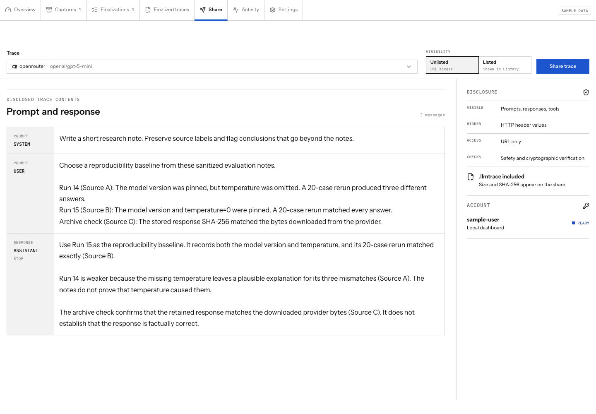
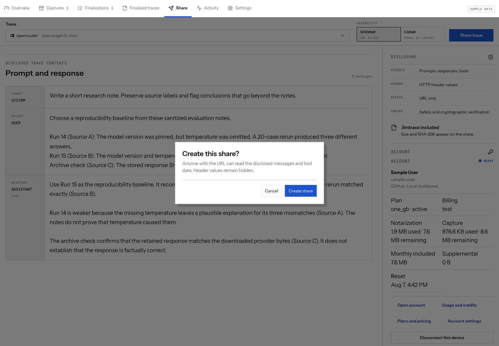
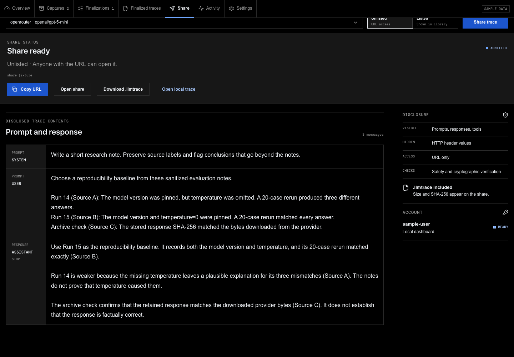
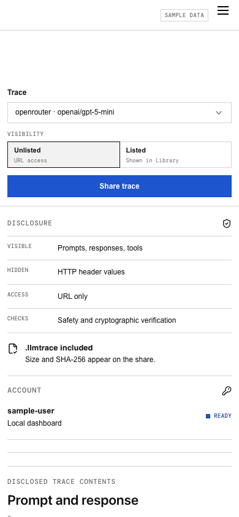

# Local evidence dashboard

Open [http://127.0.0.1:8788](http://127.0.0.1:8788) while `llm-notaryd` is
running. The default configuration opens the dashboard directly. If
`admin.auth` is configured, the service asks for that username and password,
exchanges them for an HttpOnly local session, clears the fields, and does not
store the password in a URL or browser storage.

The dashboard is served only by the loopback administration listener. The
provider proxy on port 8787 never serves it.

## Find the next useful action

**Overview** shows service, vault, notary, and work-queue health. The
capture-state strip distinguishes live captures, captured evidence, active
finalization work, finalized traces, and failures. Recent activity uses safe
event summaries and links back to the relevant work.


Use the sidebar to move between these parts of the local workflow:

- **Captures** searches and filters private evidence, then opens a selected
  capture in a detail panel.
- **Finalizations** shows durable queued, running, interrupted, failed, and
  completed proof operations.
- **Finalized traces** presents the portable `.llmtrace` package, makes its
  exact bytes the primary download, and offers an independent local
  verification action.
- **Share** previews the disclosed conversation, chooses Unlisted or Listed,
  and keeps public sharing separate from local proof creation.
- **Activity** shows a bounded redacted event stream.
- **Settings** reports safe listener, vault, preview-policy, and notary trust
  state from `GET /v1/notaries`, contains the color-scheme control, and links
  to the live OpenAPI contract. The notary records show configured trust and
  lifecycle windows, not endpoint health.

## Inspect a capture

Use full-text search over enabled previews, then narrow by model, provider,
capture state, finalization state, streaming mode, or time. A result always has
a textual state; color is only a second signal. The detail panel shows safe
model and response metadata, a lifecycle, privacy-aware truncated previews,
artifact availability, hashes, and prior finalization state. It never decrypts
or renders the source capture. The finalization history links every durable
operation for that capture to its detailed attempt history.


A captured response that has not yet been finalized has one **Finalize** action. The service responds with a
durable operation, and the dashboard moves to its finalization view. Repeating
the action resolves to the already-active operation and is labeled as
deduplicated; it does not create parallel work.

If the provider returned a non-success HTTP status, the capture stays visible
but the dashboard replaces **Finalize** with the provider status and the stable
`unsupported_provider_http_status` explanation. It does not offer a retry for
that deterministic incompatibility.

## Monitor and retry finalization

The operation queue shows state, capture identifier, attempt, enqueue time, and
the current finalization milestone. The inspector shows timestamps and
`attempt_history`, with one durable record for each worker attempt. Proof
generation may take minutes and usually dominates finalization, so the UI does
not divide the milestones into equal segments. While proving, its bar shows the
actual ratio of authenticated private-transcript bytes and a separate completed
commitment count. Signing and packaging remain named milestones rather than
invented percentages.

Failed and restart-interrupted operations show only a safe failure code.
**Retry finalization** appears only when the service marks the operation
`retryable`; retry requeues the same durable operation.


## Verify a finalized trace

Select **Finalized traces**, choose a capture, and inspect four document-like
views:

- **Summary** describes the authenticated inference and package format, then
  renders the disclosed prompt and response as a readable conversation. This
  is finalized trace content, not decrypted source-bundle data.
- **Evidence** shows the exact trace hash, authenticated provider, source time,
  and manifest format reported by the selected package.
- **Trace** shows the canonical OpenTelemetry document.
- **Verification** contains the human-readable result of the current check after **Verify
  locally** rechecks the package.

**Download verified package** saves the exact canonical
`<capture-id>.llmtrace` bytes produced by finalization. It is the artifact to
retain, share privately with an intended verifier, or submit for a public link. The
package discloses request and response bodies; review that privacy boundary
before sharing it. The source `.llmcapture` remains vault-encrypted private
retry state and is never a shareable verification artifact.


Bundle availability is not the same as trace verification. Only the
successful verification result confirms that the finalized package's evidence,
disclosure, hashes, provider mapping, and canonical trace bytes agree.

## Share only with consent

The Share view shows the disclosed conversation before upload, then asks for
Unlisted (the default) or Listed visibility. Both start accessible to anyone
with the link; Unlisted only stays out of the Library. After admission, the
hosted account’s Traces view can unpublish the share, require a password, or set
an expiry. The source `.llmcapture` is never an input, and
nothing is uploaded merely because a trace was finalized or verified. After
submission, the dashboard polls `GET /v1/shares/{share_id}` through the local
service. Successful admission makes **Copy link** the primary action and also
offers the exact admitted package for independent verification. Remote account
credentials never enter the browser.



Before upload, a blocking confirmation names the selected visibility and
repeats that disclosed prompts, responses, and tool details become public to
anyone with the link.



Admission reports scanning and verification progress without implying that a
link is ready early. Once admitted, the stable link is the primary result.



## Activity and settings

Activity asks the service to filter by severity, capture identifier, operation
identifier, event type, or time instead of downloading a broad history and
filtering it in the browser. Events contain bounded messages and identifiers,
never request bodies, response bodies, raw headers, credentials, or filesystem
paths. Settings shows safe runtime facts, the System/Light/Dark control, and
the exact `http://127.0.0.1:8788/openapi.json` discovery URL for scripts and
coding agents.

## Responsive navigation and color mode

At 820 px and below, a fixed menu button opens the sidebar as a full-height
drawer, and capture and trace list/detail workspaces become separate routed
panels. The local app has no separate header; its brand and navigation live in
the desktop sidebar. Use the back action to return from an inspector. Keyboard
focus is visible, dialogs and drawers return focus to their trigger, and
reduced-motion preferences are respected.


After the drawer closes, the selected capture occupies a single mobile panel
with a clear back action; the desktop list is not squeezed beside it.


The Share view also collapses to one column. The visibility decision remains
ahead of the disclosed conversation preview, so public consent is readable on
a narrow screen without hiding the session contents.




Settings provides **System**, **Light**, and **Dark** choices. System follows
the operating-system preference and is the default. An explicit override is
stored locally and can always be returned to System. Dark mode uses neutral
charcoal surfaces; the lime accent remains reserved for verified or ready
states and a focal action.

## Troubleshooting

| Symptom | What to check |
| --- | --- |
| Service unavailable | Confirm the foreground process is running and the browser uses the configured loopback admin address, normally port 8788. |
| Address already in use | Stop the other process or assign distinct loopback `proxy.listen` and `admin.listen` ports, then restart. |
| Unauthorized session | Confirm that `admin.auth` is enabled, then enter its configured username and password. Restart the service after changing the hash. Never add the password to the URL. |
| Vault unavailable | Unlock the OS credential store or supply the configured private passphrase file, then restart. Do not move encrypted bundles outside their initialized vault profile. |
| Notary directory unavailable | Check network access and directory configuration. An explicit local notary endpoint is appropriate only for local/self-hosted development. |
| Operation interrupted | A running job was stopped by service restart. Inspect its safe code and use Retry finalization. |
| Missing artifact | Keep metadata and its filesystem directories or private S3 prefix together. Check `artifact_missing`, `artifact_corrupt`, `artifact_backend_unavailable`, or `artifact_backend_unconfigured`; the API intentionally does not accept a replacement path or object key. |
| Safe failure code | Use the code for diagnosis, then inspect local process logs. Logs omit credentials, headers, and evidence plaintext but may contain configured paths, so do not share them verbatim. |

## Documentation fixture and screenshots

All images above come from `js/app/src/local-dashboard/fixtures.ts`. The data
is synthetic and fixed: it contains no real user prompts, provider keys, account
names, local paths, or bundle contents. The dashboard labels this state
**Sample data** and starts with the synthetic
`sample-user` identity already connected. Neither label describes a production
account type. Desktop viewports use 1440 × 1000 px;
the mobile viewport uses 390 × 844 px. The browser locale is `en-US` and its
timezone is UTC so timestamps remain deterministic. The overview,
finalization, sharing confirmation, and mobile images use Light mode. Captures,
trace verification, and the admitted share use Dark mode.

Interactive fixture actions are simulated entirely in the browser. Device
authorization never opens GitHub, sharing advances from queued to admitted
without an upload, and the admitted-fixture action returns to the synthetic
local trace. The fixture Vite server also serves the generated contract at
`/openapi.json`, matching the real admin listener. No fixture action contacts a
provider, notary, sharing platform, or account service.

Finalization advances deterministically from queued to running to finalized as
the operation is polled. The fixture does not add the capture to Finalized
traces until that last transition. Its capture, operation, package, provider,
model, disclosed content, verification, and share all retain the same
synthetic identity.

When opened normally, fixture timestamps are generated relative to the current
time. A visible note identifies operation states as simulations rather than
real background workers. Screenshot generation supplies an explicit fixed
fixture clock so the committed images remain reproducible.

Regenerate every image from the repository root after a dashboard change:

```bash
npm --prefix js/app ci
npx --prefix js/app playwright install chromium
npm --prefix js/app run capture:dashboard-docs
npm --prefix js/app run check:local-docs
```

The capture command starts an isolated Vite server on `127.0.0.1:4175`, opens
fixed fixture deep links in headless Chromium, and replaces only the eleven files
under `docs/images/local-dashboard/`. Review every image for layout and
sensitive data before committing it.
